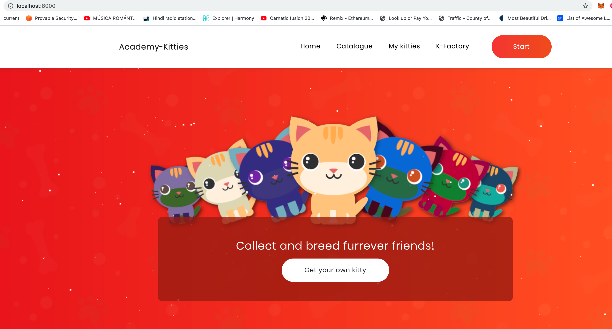

# CryptoKitties clone project



## Starter kit

### install the dependencies

You will also have to create a .secret files to deploy the contract on the testnet later

```
npm i
touch .secret
```

### start your local ganache

For testnet deployment you can skip this step. 

```
ganache-cli --port 8545 --accounts 5  --mnemonic 'gesture rather obey video awake genuine patient base soon parrot upset lounge' --networkId 5777
```

### migrate the main contract to your local node

```
truffle migrate --network harmony
```

### run your local server

```
cd client
python -m SimpleHTTPServer 8000
```

## Workflow

To make this project manageable the idea is to work with tags, most of the development will start from the dev branch.
Each step of the project will be developed on a stage branch "stage_1" "stage_2" ect.. Then merge on master with a tag associate to the stage.

### stage 1

Stage 1 is a simple interface to generate random kitties and save them on the cryptokitties smart contract.
This stage will contain the creation of the student frontend, a basic Factory smart contract, the npm package installation

## stage 2

The frontend will allow the student to create multiples gene 0 cats with a range slider, to select them individually.
The smart contract will be improve to track cats ownership, transfert, transfertFrom.

ERC 721.

The following standard allows for the implementation of a standard API for NFTs within smart contracts. This standard provides basic functionality to track and transfer NFTs.

A standard interface allows wallet/broker/auction applications to work with any NFT on Ethereum. We provide for simple ERC-721 smart contracts as well as contracts that track an arbitrarily large number of NFTs. Additional applications are discussed below.

EIP
https://eips.ethereum.org/EIPS/eip-721

Help:
https://docs.openzeppelin.com/contracts/2.x/api/token/erc721

ERC 165

ERC165’s solution is to define a standard for contracts to publish what interfaces they support, so that other contracts can follow the same standard to detect whether it supports certain interfaces, and only call the interface’s function if the interface is supported.


EIP
https://github.com/ethereum/EIPs/blob/master/EIPS/eip-165.md
Help:
https://medium.com/coinmonks/ethereum-standard-erc165-explained-63b54ca0d273


## stage 3

The frontend gives the user an option to make the cats the cats breeding.
The smart contract will use the parents DNA to create a new unic cat.
Do you want to include an oracle functionality with a random variable to give the cats Rare capabilities ?
it will be nice to introduce this concept which is not in the original cryptokitties app
We will also have to setup the cat cooldown.

## stage 4

A marketplace can be setup to sell your cats
